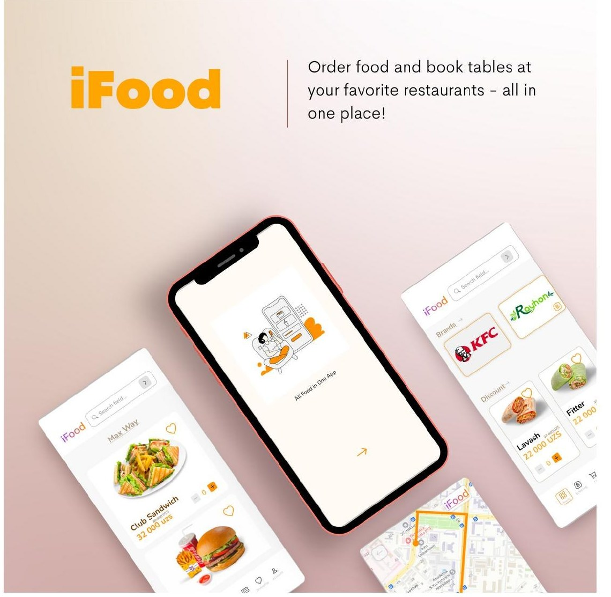
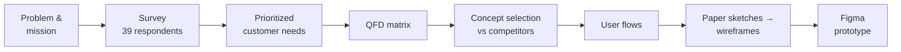
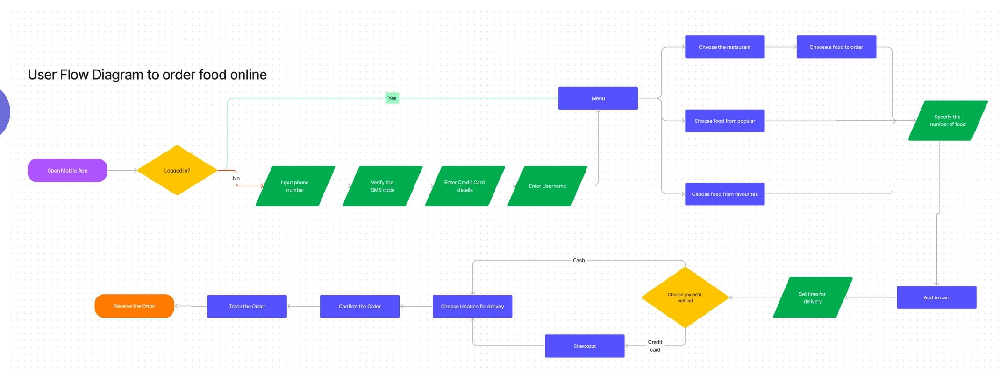
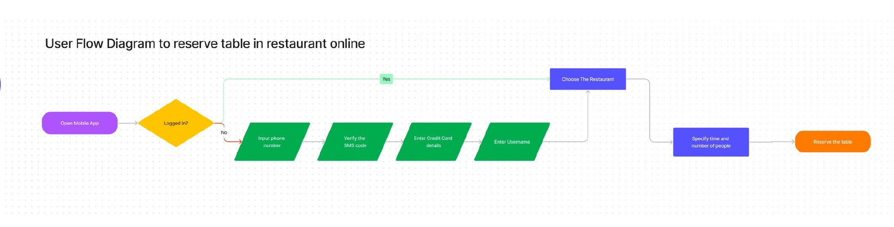
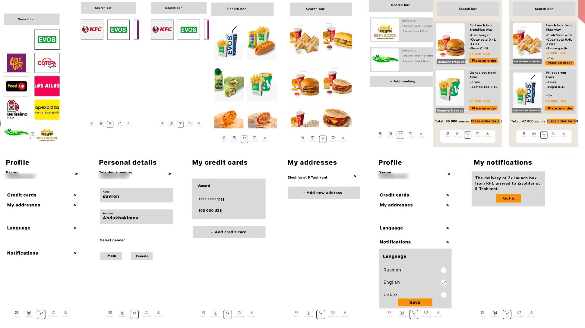
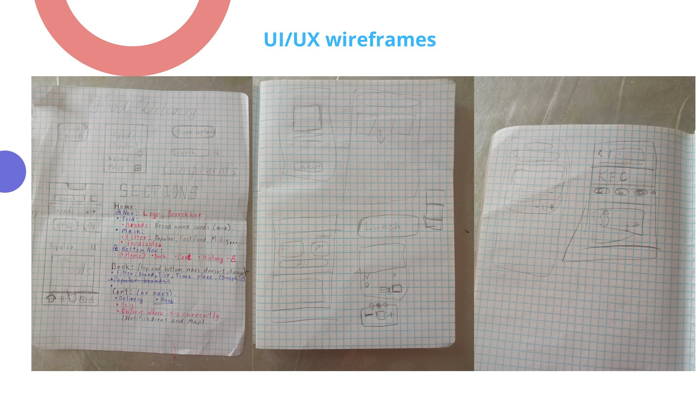

# iFood: Food Delivery and Table Booking App (UX Case Study)

A user-centered design project for a food delivery app in Uzbekistan that also lets users **book restaurant tables in advance**. It runs from customer research through QFD and concept selection to a clickable Figma prototype.

  

**[▶ Clickable prototype (Figma)](https://www.figma.com/proto/lozrUpbJXAPYPLyat3E1my/Food-Design?page-id=0%3A1&node-id=119-1518&viewport=3425%2C-61%2C0.64&scaling=scale-down&starting-point-node-id=41%3A340)** · [Design file](https://www.figma.com/file/lozrUpbJXAPYPLyat3E1my/Food-Design?node-id=0%3A1&t=P80e0DwTFWEGUuKJ-1) · [User flows (FigJam)](https://www.figma.com/file/dZQRUVjcHQpio2k8z64CAH/User-Flow?node-id=0%3A1&t=zML813kZQu8hAheh-1)

> University team project (Team Gradient, 6 members), Inha University in Tashkent, 2023.

## Process

## 1. Problem

Local delivery apps showed four recurring pain points: long delivery times, unexpected fees, restaurants overwhelmed at peak demand, and cluttered interfaces. Neither of the two main local competitors let users **reserve a table**.

## 2. Customer research

An online survey of 39 people in March 2023 ([raw responses](research/survey_responses.csv)):

| Finding | Share of respondents |
| --- | --- |
| Real-time order tracking is very important | **89%** |
| Would like to reserve restaurant seats through the app | **83%** |
| Promotions and discounts are very important | 82% |
| Find current apps easy to order with | 78% |
| Say some or most prices are high | 61% |
| Food sometimes arrives later than promised | 37% |
| Want more payment options | 27% |

Open-ended answers added location-picking frustration, broken promo codes, lag, and requests for order cancellation and a cleaner UI.

### Prioritized needs

| Customer need | Importance (1–5) |
| --- | --- |
| Easy to use | 5 |
| Real-time order tracking | 4 |
| Variety of payment options | 4 |
| Short delivery time | 4 |
| More integrated restaurants | 3 |
| Reserve seats in restaurants | 3 |
| Find delivery location easily | 3 |
| Low prices | 3 |
| More food and drinks in menus | 2 |

## 3. Product specification (QFD)

Each need was mapped to functional requirements (relationships: 9 strong, 4 moderate, 1 weak). Technical importance shows where design effort pays off most:

| Functional requirement | Technical importance |
| --- | --- |
| Delivery time | **52** |
| Location handling | 48 |
| Pricing | 46 |
| User interface | 45 |
| Payment options | 39 |
| Restaurant list | 39 |
| Table booking | 39 |
| Restaurant menu | 18 |

## 4. Concept selection

iFood was screened as the reference concept against the two main local alternatives:

| | iFood | Express 24 | Yandex Eats |
| --- | --- | --- | --- |
| Real-time order tracking | ✓ | weaker | ✓ |
| Table reservation | ✓ | ✗ | ✗ |
| Net score vs iFood | reference | −2 | −1 |

## 5. Core features

- Order from favorite restaurants in a few steps
- Reserve tables for any time
- Track order status in real time
- Search restaurants and browse menus
- Pay by card (Uzcard) or cash
- Save multiple delivery addresses

## 6. User flows

**Ordering food**

**Reserving a table**

## 7. From sketches to wireframes

Paper sketches were iterated into final wireframes covering browsing, cart, bookings, profile, payment cards, addresses and notifications.

Early paper sketches

UX principles applied: Aesthetic-Usability Effect, Hick's Law, Jakob's Law, Law of Proximity, Goal-Gradient Effect, Law of Similarity.

## 8. Limitations and next steps

- No rating or review system for delivery service
- No loyalty program, although 82% of respondents value promotions
- No in-app customer support channel
- Competes with Express 24 (the most used local app) and Yandex Eats (richer feature set)

## Tools

Figma · FigJam · Google Forms · Excel (QFD matrix)

## Team

Abdukhakimov Davron, Abdusattorov Safixon, Axmedov Mirabbos, Aliqulov Asror, Aydinov Elbek, Abdullayev Sarvarjon.
