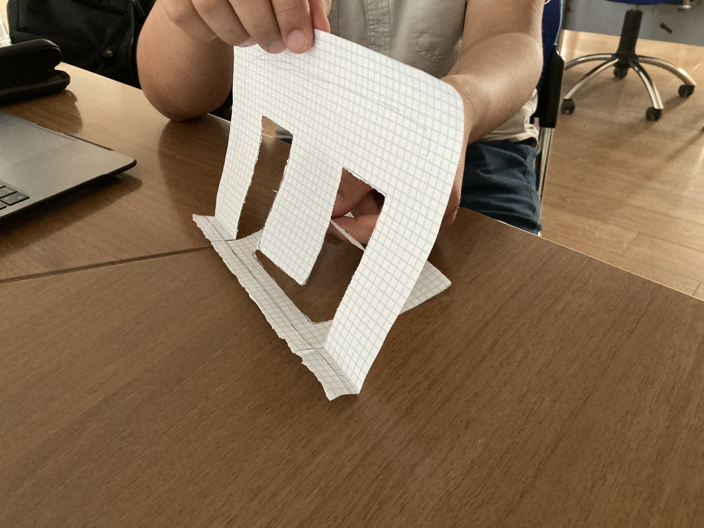
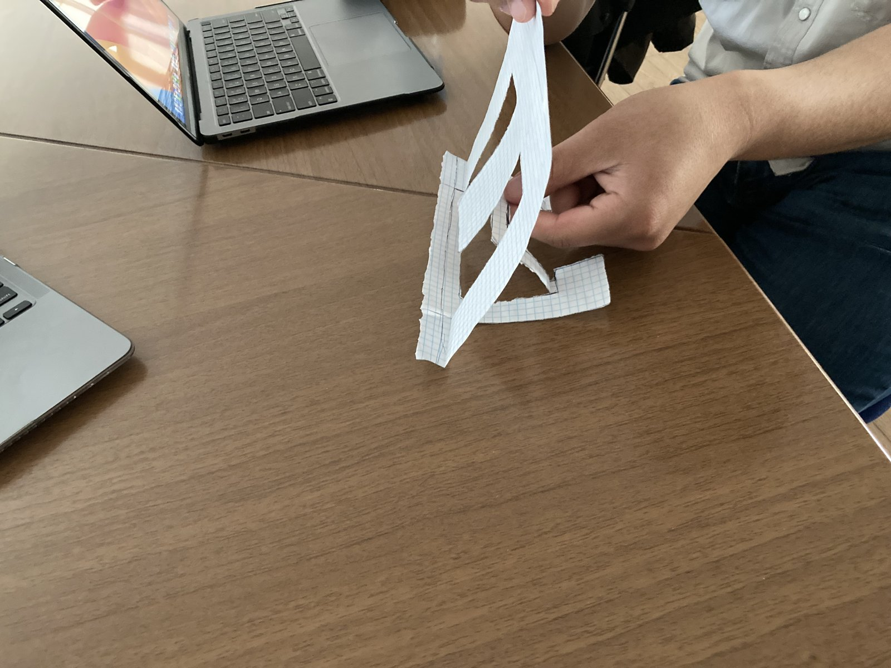
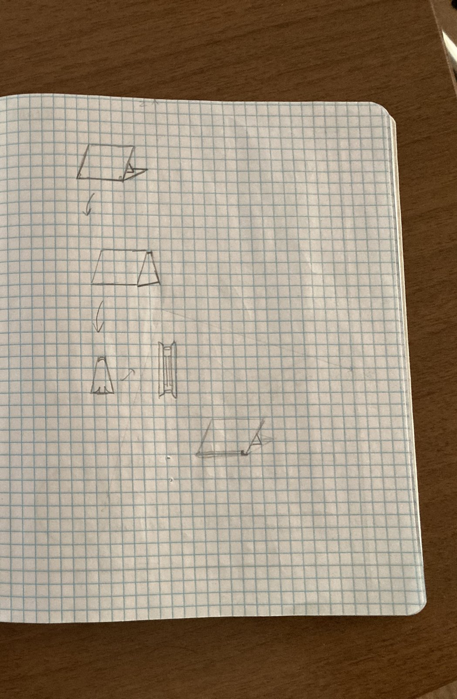
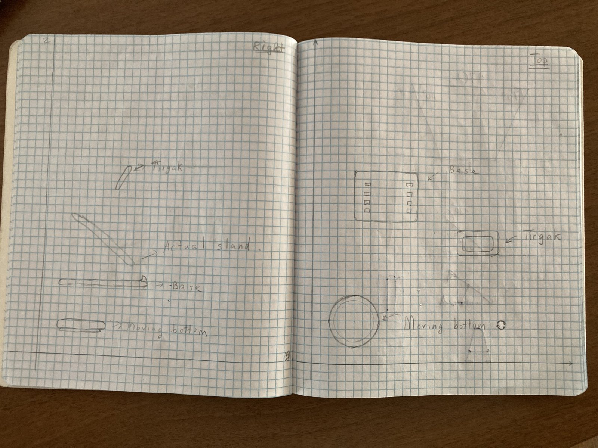
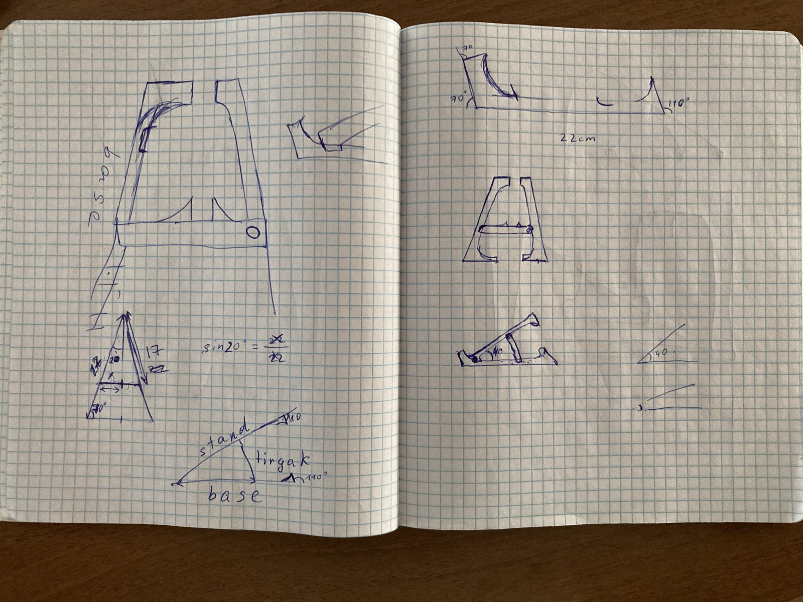
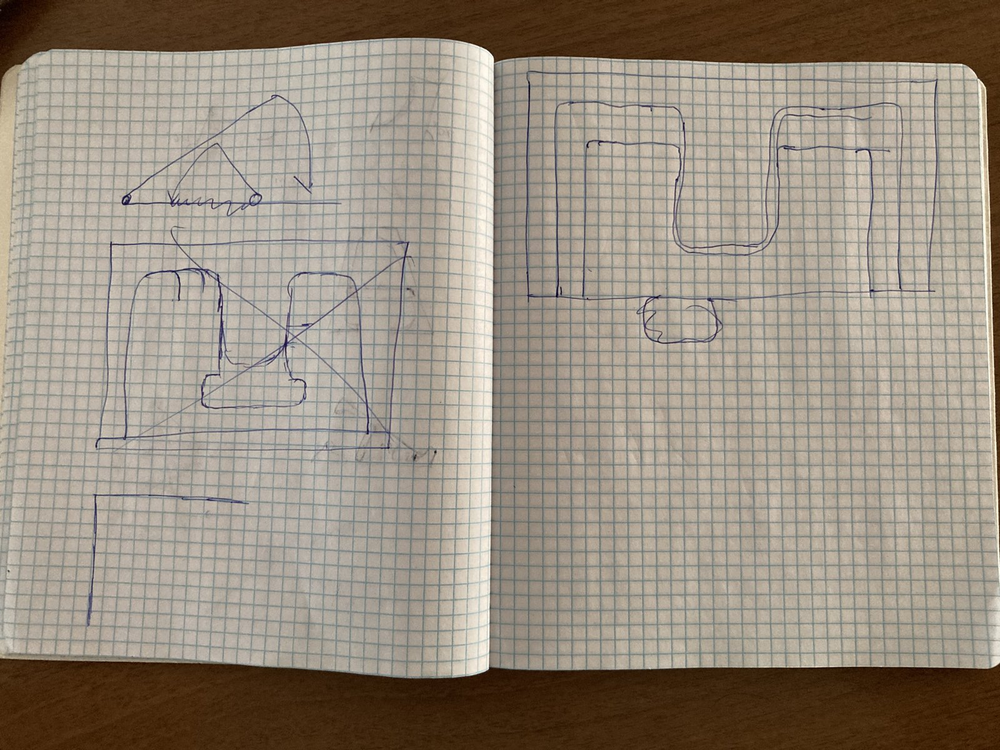
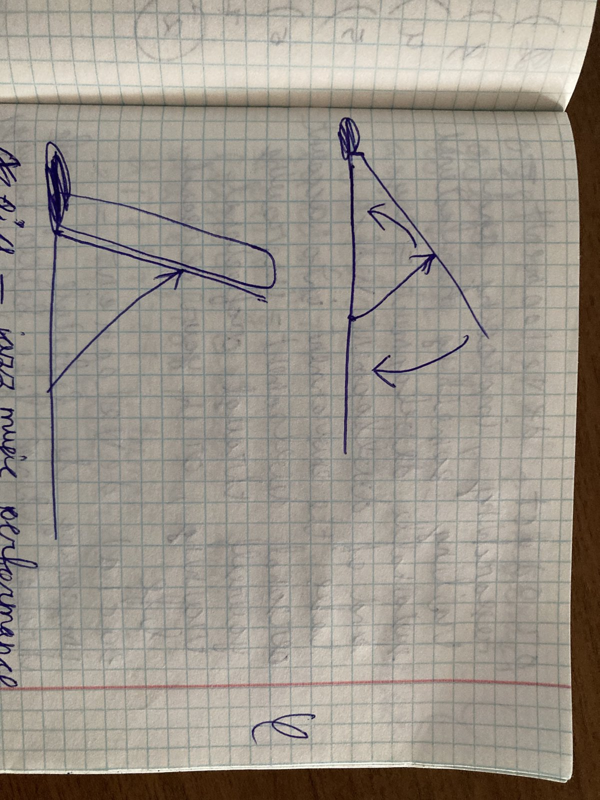

# Adjustable Device Stand: Concept Sketches and Paper Prototype

An early-stage product design for a foldable phone or tablet stand with an adjustable angle and a rotating base. The work goes from hand sketches with angle calculations to a paper prototype used to test the fold.

  
  

## Design

| Part | Role |
| --- | --- |
| Stand | Tilted panel the device leans on |
| Base | Flat plate with two rows of slots that set the tilt angle |
| Prop (*tirgak*) | Brace that locks into a base slot and holds the stand at the chosen angle |
| Rotating bottom | Round turntable under the base so the stand can swivel |

The sketches work out the support geometry (for example, the prop position from sin 20°), a 22 cm overall size, and how the panel folds flat against the base.

## Process

1. Exploratory shapes and part breakdown
2. Orthographic side and top views with labeled parts
3. Angle and dimension calculations
4. Layout of the parts on a single sheet for cutting
5. Folding-motion study
6. Paper prototype to check stability and the fold

All sketches

