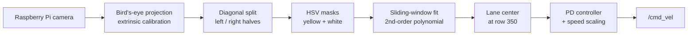

# TurtleBot3 Autonomous Driving: Lane Following and Maze Navigation

Two robotics projects on a **TurtleBot3** with **ROS**, developed in Gazebo simulation and then tuned on a physical track.


> Capstone Design (ICE/CSE4020), Inha University in Tashkent, 2026. Team of 8.

## Project 2: AutoRace lane-following speed challenge

The robot follows a taped lane around a track as fast as possible without crossing the lines. It uses camera-only perception and a PD controller.

**Best run: full lap in 3:55 with zero line crossings.**

| Physical robot (external camera) | Lane detection view (RViz + terminal) |
| --- | --- |
| [](https://youtu.be/GhWTKt1aM60) | [](https://youtu.be/uTUiQQVg6QU) |

### Pipeline



Built on the ROBOTIS `turtlebot3_autorace_2020` baseline and extended with:

- **Three-stage state machine** that switches on which lane color is visible:

  ```mermaid
  stateDiagram-v2
      direction LR
      S1: Stage 1 - follow yellow
      S2: Stage 2 - follow white
      S3: Stage 3 - re-acquire yellow
      T: 90° turn and stop
      [*] --> S1
      S1 --> S2: no yellow, white on both sides
      S2 --> S3: yellow reappears
      S3 --> T: both sides above 25k px, then yellow disappears
      T --> [*]
  ```

- **Diagonal image split.** A trapezoidal mask replaces a fixed vertical cut, so lane lines that converge toward the horizon stay on their own side.
- **Single-lane fallback.** When only one line is visible, the center is estimated by offsetting that line by 270 px (about half a lane width).
- **PD steering with nonlinear speed scaling:**

  ```
  error     = center_x − 500
  angular_z = Kp·error + Kd·(error − last_error)      clamped to ±2.0 rad/s
  linear_x  = max_vel · (1 − |error| / 500)^2.2
  ```

  The robot drives at 0.2 m/s on confirmed straights and slows to 0.1 m/s or less on curves.

All tuned values are in [`config/lane_detection_params.yaml`](config/lane_detection_params.yaml).

### Problems solved on the real robot

| Problem | Fix |
| --- | --- |
| Extrinsic calibration sliders could not reach the camera's mounting angle | Widened the allowed ranges in the calibration source |
| Yellow tape washed out under fluorescent light | Raised sharpness, saturation and contrast in `raspicam_node` |
| Controller reacted to stale frames and overshot on curves | Lowered camera FPS to cut pipeline latency |
| Baseline assumes white-left / yellow-right, but the track was yellow only | Rebuilt detection around yellow: diagonal split, single-lane offset, Stage 3 re-acquisition |
| Slow lap at constant conservative speed | Speed boost on straights with nonlinear slowdown in curves |

### Results

| Run | Lap time | Major crossings | Minor crossings |
| --- | --- | --- | --- |
| Best testing run | **3:55** | 0 | 0 |
| Final demo run | 4:34 | 4 | 0 |

On demo day, lighting at two curves differed from testing, so the yellow mask briefly lost the line. Adaptive thresholds or lighting normalization would be the next improvement.

## Project 1: Maze navigation

TurtleBot3 navigating a maze.

<!-- TODO: add 2-3 sentences on the approach (sensors, algorithm) and the result. -->

| Robot in the maze | View from the monitor |
| --- | --- |
| [](https://youtu.be/ty2u_mNBT_w) | [](https://youtu.be/POOIgBrvuBI) |

## Tech stack

ROS · Python · OpenCV · NumPy · Gazebo · RViz · TurtleBot3 Burger · Raspberry Pi camera (`raspicam_node`) · `dynamic_reconfigure`

## Team

Abdukhakimov Davron, Khamdamov Bobomurod, Alikulov Asror, Normamatov Davronbek, Tukhtamurodov Sardorbek, Mirkamoliddinov Ibrohimbek, Mirshokirov Mirsaid, Sodikov Dilyor.
