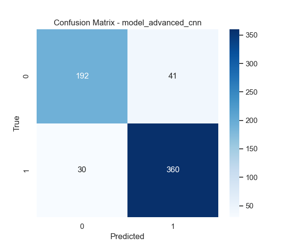
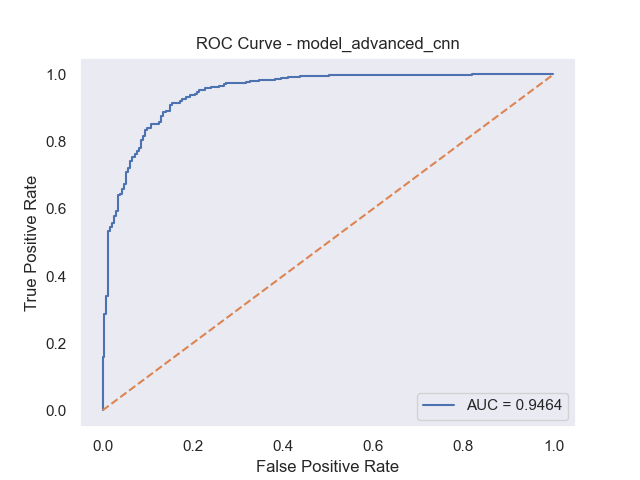
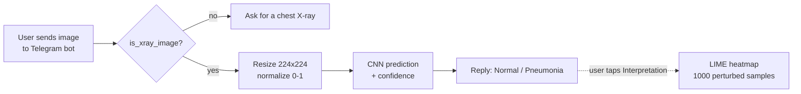
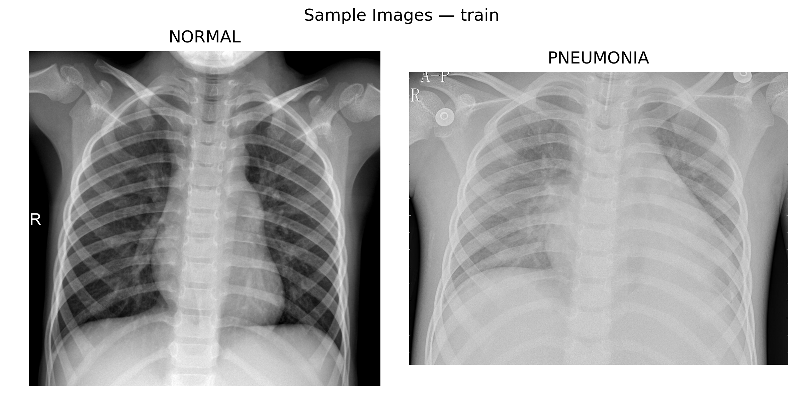

# Dr. XRayDetect: Pneumonia Detection from Chest X-rays

A deep learning pipeline that classifies chest X-rays as **Normal** or **Pneumonia**, explains each prediction with a **LIME** heatmap, and is served through a **Telegram bot**.


> University team project (6 members), Inha University in Tashkent.

## Results

Three CNNs trained from scratch, evaluated on the held-out test set (623 images):

| Model | Accuracy | Precision | Recall | F1 | AUC-ROC |
| --- | --- | --- | --- | --- | --- |
| Basic CNN | 88.0% | 89.7% | 91.3% | 0.905 | 0.941 |
| Deep CNN (BatchNorm) | 88.1% | 87.4% | **94.6%** | 0.909 | 0.938 |
| **Advanced CNN (ResNet-style)** | **88.6%** | **89.8%** | 92.3% | **0.910** | **0.946** |

Recall was the main metric, since a missed pneumonia case costs more than a false alarm.

<p align="center">
  
  
</p>

## How it works



- **X-ray filter** (`image_check.py`): rejects images that are not plausibly X-rays by checking aspect ratio, color uniformity across RGB channels, contrast and brightness.
- **Classifier** (`models.py`): three architectures, from a simple baseline to residual blocks.
- **Explainability** (`interpret.py`): LIME highlights the image regions that pushed the model toward its decision.
- **Bot** (`bot.py`): async `python-telegram-bot` app; LIME runs in a thread pool so the bot stays responsive.

## Models

| Model | Architecture |
| --- | --- |
| Basic CNN | 3 × (Conv 3×3 + ReLU + MaxPool) → Dense 128 → Dropout 0.5 → Sigmoid |
| Deep CNN | 4 × (Conv 3×3 + BatchNorm + ReLU), MaxPool, Global Average Pooling → Dense 256 → Dropout 0.5 |
| Advanced CNN | Residual blocks (64/128/256) with separable convolutions, BatchNorm, LeakyReLU, 1×1 skip projections |

Training: Adam (lr 1e-4), binary cross-entropy, early stopping (patience 5), ReduceLROnPlateau, up to 20 epochs.

## Dataset

[Chest X-Ray Images (Pneumonia)](https://www.kaggle.com/datasets/paultimothymooney/chest-xray-pneumonia) by Paul Mooney on Kaggle.

| Split | Normal | Pneumonia | Total |
| --- | --- | --- | --- |
| Train | 1,341 | 3,875 | 5,216 |
| Test | 233 | 390 | 623 |

The training set is imbalanced (about 3:1 toward pneumonia). Augmentation (rotation, shift, zoom, horizontal flip) reduces overfitting, and recall plus AUC were tracked alongside accuracy.

<p align="center">
  
</p>

## Run it

```bash
cd xray-pneumonia-detection
pip install -r requirements.txt

# 1. Download the Kaggle dataset and extract it as ./chest_xray/{train,val,test}
python analyze_dataset.py   # dataset plots -> analysis_figures/
python train.py             # trains all 3 models -> saved_models/
python evaluate.py          # metrics, confusion matrix, ROC -> figures/

# 2. Run the bot
export TELEGRAM_BOT_TOKEN="your-token-from-botfather"
python bot.py
```

## Project structure

```
├── config.py            # paths, hyperparameters, env-based settings
├── data_preparation.py  # Keras generators + augmentation
├── analyze_dataset.py   # class balance, sample images, size and intensity plots
├── models.py            # Basic, Deep and Advanced CNNs
├── train.py             # training loop with callbacks
├── evaluate.py          # test-set metrics and plots
├── visualize.py         # training curves, confusion matrix, ROC
├── image_check.py       # heuristic X-ray filter
├── interpret.py         # LIME explanations
├── bot.py               # Telegram bot
├── train_on_test.py     # experiment only (see Limitations)
├── figures/             # evaluation outputs
└── analysis_figures/    # dataset analysis outputs
```

## Limitations and next steps

- The Kaggle validation split has only 16 images, so validation curves are noisy. A larger split carved from training data would give steadier early stopping.
- `train_on_test.py` fine-tunes on the test split; it is kept as an experiment, and the scores above do **not** come from it.
- The X-ray filter is rule-based and can be fooled by grayscale non-X-ray images.
- Next: Grad-CAM as a second explanation method, multi-class labels (bacterial vs viral), and a web API.

This is an educational project, not a medical device.

## Team

Buzurxanov A'zamxon (lead), Abdukhakimov Davron, Ergashev Javlon, Alikulov Asror, Abdusattorov Safikhon, Khudoyberdiev Sherdor.
